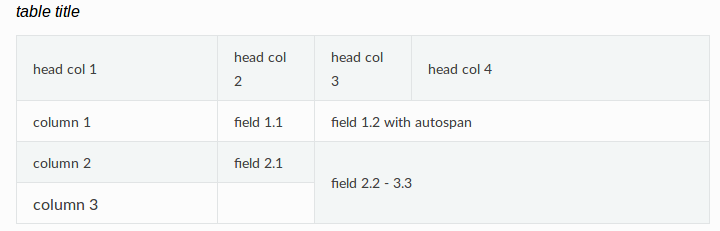

# Sphinx

## Sphinx

* Desenvolvido para fazer a documentação do python (https://docs.python.org/3/)

* Suporte para documentar projetos em diversas linguagens

# Algumas características

## Formatos de saída

* html
* latex
* epub
* ...

## Referências cruzadas

* linguagem de marcação (markup) semântico
* links automáticos para funções, classes, citações, glossários

## Estrutura hierárquica

* Simples definição de árvores de documentos 
* Links automáticos para filhos, pais, ...

## Outros

* Indices automáticos

* Highlight de código automático

## Extensões

* Testes de pedações de códigos (snippets)
* Inclusão de docstring de módulos python

## Formatos/Ferramentas

* reStructuredText
* Docutils

## Instalação

* pip3 install sphinx

# Sintaxe reSt

## Parágrafos

* parágrafos são blocos de texto separados por espaço em branco
* identação importa - todas as linhas de um mesmo parágarfo deve estar
alinhada à esquerda no mesmo nível de identação

## Marcação 'inline'

* _`*itálico*`_
* __`**negrito**`__
* \`\`snippets\`\`
* usar `\` para utilizar o asterísco ou crase
* não pode ser aninhado
* conteúdo não pode terminar nem começar com espaço em branco
* precisam estar separdos por um caracter não-letra (pode-se usar barra 
invertida espaço para deixar letras "coladas")
* roles: provê marcação semântica e referência cruzada entre identificadores, 
e serve também para formatação:
    * exemplo: subscript
```
H\ :sub:`2`\ O
```

## Listas

* Pode ser usar ` * `, listas numeradas, ou `#` para listas autonumeradas
* Listas aninhadas são necessitam de linha em branco:

```
* this is
* a list

  * with a nested list
  * and some subitems

* and here the parent list continues
```

* Parágrafos de citação:

```
| These lines are
| broken exactly like in
| the source file.
```

## Código fonte

* para ser inserido um bloco de código fonte, é necessário colocar o marcador
especial `::` ao fim do parágrafo
* então separar por linhas em branco, e o código deve ser identado
* exemplo:

```
The next paragraph is a code sample::

   It is not processed in any way, except
   that the indentation is removed.

   It can span multiple lines.

This is a normal text paragraph again.
```

## Mais referências à sintaxe

* http://www.sphinx-doc.org/en/stable/rest.html

# Começando um novo projeto

## Configuração de projeto

* sphinx-quickstart
* cria pastas e arquivos básicos


## conf.py

* configurações gerais
* quais módulos vão estar habilitados
* ...


# Referências específicas para o Kernel

## Instalação para documentação do kernel

* Documentação do kernel sugere utilizar um ambiente virtual

```
$ virtualenv sphinx_1.4

$ . sphinx_1.4/bin/activate

(sphinx_1.4) $ pip install -r \
Documentation/sphinx/requirements.txt
```

* Para trabalhar com imagens instalar pacotes GraphViz e ImageMagick (irão dar
  suporte à GraphViz e arquivos svg)

* Script para verificar dependências do sphinx: /scripts/sphinx-pre-install

## Gerando documentação do Kernel

* make htmldocs
* make pdfdocs
* Documents/output
* para limpar: make cleandocs
* passar configurações para o sphinx usar variável de ambiente SPHINXOPTS


## Escrevendo documentação para o kenel

* Passos simples:
    * Adicionar um arquivo .rst em algum lugar de Documentation
    * Referenciar esse arquivo na TOC Tree principal de Documentation/index.rst

* Em alguns casos uma pasta específica (como subsistema de gpu), com index.rst
  próprio

## Diretrizes específicas para o kernel

* Não extrapole no uso do reStructuredText. Mantenha simples.
* Mantenha modificações de formato mínimo quando for converter documentação
  existente para rSt

* Atualize também o conteúdo, quando for converter

## Diretrizes específicas para o kernel

* Matenha essa ordem para sintaxe de títulos:

```
===================
Título de documento
===================
```

```
Capítulos
=========
```

```
Seção
-----
```

```
Sub-seção
~~~~~~~~~
```


## Diretrizes específicas para o kernel

* Para trechos de código (que não se beneficiem de "highlight") use `::`

* Para trechos de código maiores, que se beneficiem de "highlight" use `..
  code-block:: <language> `

## list tables

* Para tabelas é recomendado _list tables_, ao invés do ASCII-art
* É fácil de criar e modificar, e o diff tem muito mais significado 

## flat table

* é uma lista de dois estágios similiar à list tables, com algumas
  características adicionais:
    * cspan: permite que uma celula seja extendida através de colunas
      adicionais
    * rspan: idem, porém através de linhas
    * _auto span_ : padrão é estender a celula à direita, caso nem todas as
      celulas estejam definidas
    * pode-se usear _fill cells_ para que sejam criadas celulas vazias ao invés
      de estender

## flat table - exemplo

```rst
.. flat-table:: table title
   :widths: 2 1 1 3

   * - head col 1
     - head col 2
     - head col 3
     - head col 4

   * - column 1
     - field 1.1
     - field 1.2 with autospan

   * - column 2
     - field 2.1
     - :rspan:`1` :cspan:`1` field 2.2 - 3.3

   * .. _`last row`:
     - column 3
```

## flat table - exemplo




## Figuras e Imagens

* Usar diretivas kernel-figure e kernel-image
* Para imagem, usar formato SVG, e diretiva kernel-image

```
.. kernel-figure::  svg_image.svg
   :alt:    simple SVG image

   SVG image example
```

## Figuras e Imagens

* Aceita formato DOT também
* http://graphviz.org/pdf/dotguide.pdf

## Figuras e Imagens

* É possível inserir figuras e imagens "embutidas"

```
   :alt: foobar digraph
   :caption: Embedded **DOT** (Graphviz) code

   digraph foo {
    "bar" -> "baz";
   }
```

# kernel-doc

## kernel-doc

* Permite incluir documentação presente nos fontes do kernel
* Sintaxe:
```
.. kernel-doc:: source
   :option:
```

* Exemplo: includelinux/fs.sh (sb_end_write)

* kernel-doc está na árvore do kernel em Documentation/sphinx/kerneldoc.py
e utiliza scripts/kernel-doc para extrair a documentação do código-fonte

## kernel-doc - opções

* export: _[source-pattern]_

Inclui documentação de todas as funções no código que foram exportadas usando
EXPORT_SYMBOL ou EXPORT_SYMBOL_GPL (no arquivo indicado em source ou em 
qualquer indicado em source-pattern)

source-pattern é útil quando os comentários estão em arquivos de cabeçalho

* internal: _[source-pattern]_ 

O contrário do export (só será incluído o que não usar EXPORT_SYMBOL ou EXPORT_SYMBOL_GPL)

## kernel-doc - opções

* doc: title

Inclui documentação para `DOC: title`

Exemplo 
```
.. kernel-doc:: drivers/gpu/drm/i915/intel_audio.c
   :doc: High Definition Audio over HDMI and Display Port
```

* functions: function [...]

inclui documentação de cada função na lista


# Convenções para usar kernel-doc no código

## Como formatar os comentários

* Comentários iniciados com `/**` são reservados para kernel-doc
* `*/` para fechar
* `*` para cada linha
* os comentários devem vir logo antes da função ou tipo descrito

## Como formatar os comentários - exemplo:

```
/**
 * foobar() - Brief description of foobar.
 * @argument1: Description argument1 of foobar.
 * @argument2: Description argument2 of foobar.
 *
 * Longer description of foobar.
 *
 * Return: Description of return value of foobar.
 */
int foobar(int argument1, char *argument2)
```

## Como formatar os comentários

* a estrutura do kernel-doc é extraída dos comentários, as funções do Sphinx 
C Domain (http://www.sphinx-doc.org/en/stable/domains.html#the-c-domain)
e descrição de tipos com ancoras são gerados deles.

## Parâmetros e argumentos

* Os comentários kernel-doc descreve cada parâmetro de uma função e typedef
ou estrutura, usando `@argument: descrição` 
* Para cada argumento não privado um `@argument` é necessário
* As linhas de `@argument` começam logo após a linha de abertura com breve 
descrição da função, sem linha em branco

## Parâmetros e argumentos

* @argument pode ter múltiplas linhas

* Se o argumento de função ou de um typedef é ... (número variável de argumentos)
a sua descrição deve seguir a seguinte notação: `@...: description`

## Membros privados

* Na descrição de uma struct ou union você pode usar as tags `private:` e `public:`

* Membros de estruturas que estão numa área `private:` não serão listadas na 
documentação

* Para se marcar essas tags, deve-se começar exatamente após o marcador `/*`

## Membros privados

* Exemplo:

```
/**
 * struct my_struct - short description
 * @a: first member
 * @b: second member
 * @d: fourth member
 *
 * Longer description
 */
struct my_struct {
    int a;
    int b;
/* private: internal use only */
    int c;
/* public: the next one is public */
    int d;
};
```

## Mais referências sobre convenções:

* https://www.kernel.org/doc/html/v4.16/doc-guide/kernel-doc.html#function-documentation

## Referências

* https://www.kernel.org/doc/html/v4.16/doc-guide
* http://www.sphinx-doc.org
* https://lwn.net/Articles/154602/ (On the value of EXPORT_SYMBOL_GPL)

## Licença

* Essa apresentação é liceciada por Creative Commons 4.0 Attribution-ShareAlike
  4.0 International 
  
  http://creativecommons.org/licenses/by-sa/4.0/

## Pandoc

* Essa apresentação foi gerada com pandoc, usando o comando:

`pandoc -t beamer pres.md -o pres.pdf`
